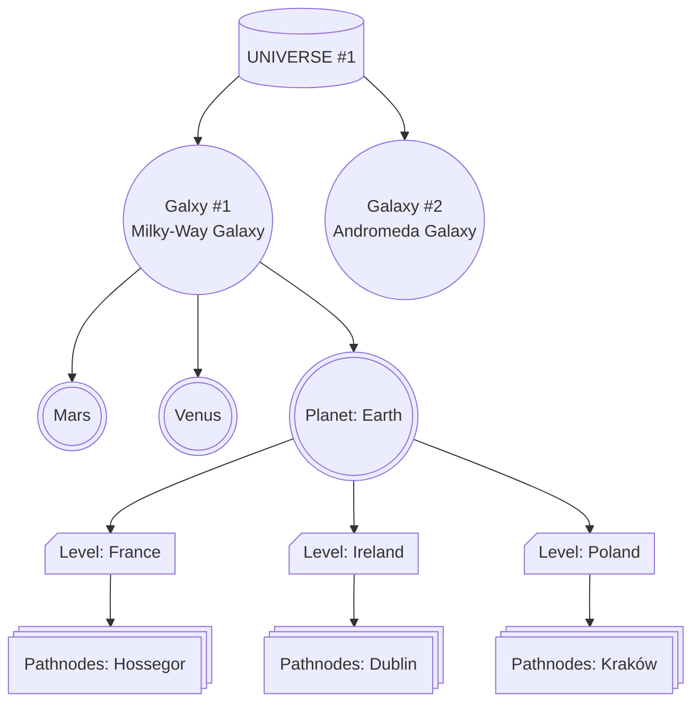

# Overview

Welcome to my repo for **Open A-Life**. 
An attempt to make an open source version of the **A-Life** system found in [GSC Game Worlds' S.T.A.L.K.E.R](https://en.wikipedia.org/wiki/S.T.A.L.K.E.R.) video game franchise.

  

### What is the "A-Life" System [S.T.A.L.K.E.R]

  

In many open world video games, the world can very often feel static. 
Actions done by the player may have very little recongnition from others or have little to no impact on the world around them. 
The purpose of A-life is to simulate this open world in the background. Any actions taken by the players should have a real impact on their enviorment and the economy.

In S.T.A.L.K.E.R, NPCs in the world have their own objectives and their own simulated free will. 
The player might be given a mission in another region to *"Save Brian from Bandits"*, but after 30 minutes, a Military Convoy could accidentally come across the bandits, apprehending them, and releasing Brain from captivity, and thus completing your quest by sheer coincidence.

Another example is when the player is in the wilderness, if they were to eliminate an enemy, leave them, and come back after a few hours, there is a chance that other animals could come over and investigate the remains.

This level of simulation in the outside world is what made the A-Life system such a special and unique feature in the S.T.A.L.K.E.R franchise.
I believe that with the number of open-world games coming out these days, this level of simulation could give that game in question that extra edge over the other titles, thus increasing sales. 

  

### What is the "A-Life" System [My version]

  

The ultimate goal of the Open A-Life project, is to make an application & platform agnostic version of the A-Life system found in the S.T.A.L.K.E.R franchise. 
Open A-Life will be written mostly in **C++20**, with plans to include either **Python** or **Lua** interpretation later on. 
It should be able to compile to **Linux and Windows**, with build scripts having a `.bat` and `.sh` versions found in the `Setup/` folder.

The Open A-Life Core will serve as a framework for other developers to implement their own functions for their open worlds. 
An `Example Engine` is included in the respository to demostrate how users can use the Open A-Life system, and possibly how they may incorporate it into their own systems.

I will consider this project to be fully completed when a developer is able to simply `#include Open_ALife.h` and able to easily add A_Life into their own projects. 

  

I have many plans for how to improve the core functionality, but for now this is a huge **work-in-progress** and is no where near complete

  
  

## Architecture

  

Open A-Life is seperated into a **Core + Application** architecture. In this repo, the ``Example Engine`` serves as the **Application** and the ``Core`` serves as the, well... the **Core**.

  

### Application

The App will always need to be able to create a **Open A_Life Scenario**. 
This **Scenario** will be a single object where the levels, factions, characters, etc, will be kept. 
This is to help ensure encapsulation. If you want to read map data, faction status, etc, you just need to get it from the **Scenario**. 

  

### Core

The Open A-Life Core Runtime is **Multi-threaded** by default and that is the main focus, 
but it can also be run on the same thread thanks the the flexibility of the C++ ``Future`` library.

The Core is comprised of multiple smaller libraries, functions, and modules that tackle different tasks.
Some of these modules aren't yet finished but will be hopefully.
  
All Thirdparty libraries can be found in `Core\ThirdParty` and are only used in `.cpp` files. 
The functions calling them are all wrappers. This is to make sure that using your own libraries is as easy as possible. 
If you don't want to use **SPDLog**, simply change the log definition found at `Core\Source\Modules\Gossiper\Log.cpp`. No changes to `Log.h` should be needed.

#### Third Party Libraries used
| Name         | Purpose | Information  |
|--------------|---------|--------------|
|``SPDLog``    | Logging | **SPDlog** is a fantastic tool for logging in C++. It supports colours and seperation of **Core** and **App** logging. More information can be found on [their Git repo](https://github.com/gabime/spdlog). |
|``CSV-Parser``| CSV I/O | This CSV library has fantastic functionality with CSV files are used heavily in OAL. More information can be found on [their Git repo](https://github.com/vincentlaucsb/csv-parser). |
|``mINI``      | INI I/O |**Mini INI** is a great library for configuring settings in the form of .ini files. More information can be found on [their Git repo](https://github.com/metayeti/mINI).|
|``Game Networking Sockets`` | TCP/UDP messaging | From Valve, this is a platform agnostic networking solution that I intend to use to remote control and updates of the OAL Scenario over IP


#### Custom Libraries used
| Name              | Purpose                   | Information  |
|-------------------|---------------------------|--------------|
|``File Wizard``    | General File Management   | **File Wizard** is a custom library for the purpose of managing various files and directories. It encorporates mINI and CSV-Parser in its operation. |
|``Director``       | Managing World Events     | The **Director** is concerned with triggering various events in the world. This is to make sure that no absolute monopolies or deadlocks happen and that the world stays eventful, preventing it from stalling.|
|``Packet Ninja``   | Network Communication     | The **Packet Ninja** was originally responcible for comunicating between the OAL Core and Application over localhost. But this is now getting replaced by **Gossiper**|
|``Gossiper``       | Logging                   | The **Gossiper** library *(better name coming soon)* acts as a wrapper for ``SPDLog``. Should You ever wish to use a different method to Log events then you would do so by overwriting the methods found in this Class.|


# How Open A-Life Works

## Scenario

### What is the Scenario
As mentioned before, the Scenario is responcible for **everything** to do with Open A-Life. 
All maps, factions, characters, etc, are handled by the Scenario. 

This is so that if you want to use Open A-Life in the Star Wars Universe for example, you simply tell the scenario to initialise using the Custom Star Wars Scenario, and the background simulation will begin.

If this is being used in a game, and the player loads an earlier save *(the landscape has changed, certain factions do/don't exist anymore, etc)*, we can just use the saved Scenario parametres from that earlier save and everything will kick off from that point.

### World

The Universe that the Scenario takes place in is called, well, the ``Universe``.
Each **Universe** will have at least one **Galaxy**,
That **Galaxy** will have at least one **Planet**,
That **Planet** will have at least one **Level**,
That **Level** will be a huge collection of **path nodes**

Here is an example of how our worlds are put together.



You *CAN* put all path nodes onto one level called "The Entire World" or something but I advise **against** that.
This is because pathfinding operations could be VERY expensive depending on your setup and I set it up this way so that all pathfinding can be done on smaller and more manageable grids.

***"This is a bit verbose no?"***

You are absolutely right. This is definitely overkill. I have us specify the Universe and Galaxy just so that if you want to make something SUPER large scale, with Galaxy hopping, it is an option. 
This also means all calculations for all planets and levels can be divided up into one different threads each or sequentially on one thread, but it is an option.


### Pseudocode

    onTick():
    
    
    for  map  in  Universe:     # Each map could have an "event" (Thunderstorms, floods, etc..) to spicen up the current map
        director.should_start_map_event(map)
    
        
        Pre_Tick:    # Apply attrition + modifiers
            for  node  in  map:
                if  node.has_modifiers() ==  True:
                    for  group  in  node:
                        group.apply_attrition_modifier()
    
    
        Faction_AI_Stage:    # Now the factions must make their choices and submit them
            for  faction  in  Factions:
                faction.make_choices()
                faction.submit_choices()
   
    
        Faction_Choice_Evaluation_Stage:     # Now we must resolve/decide all conflicts
            for  choice  in  all_submitted_choices:
                director.evaluate(choice)
                
            if  choice.conflict ==  True:
                all_conflicting_choices.append(choice)
            else:
                director.grant(choice)
          
    
        Conflict_Resolution_Stage:   # Now we must figure out what conflicts and fires we need to sort out
            for  conflict  in  all_conflicting_choices:
                director.resolve(conflict)
    

        Post_tick:
            for  event  in  map.all_current_map_events:
                event.remaining_duration -=  1.0
                if  event.remaining_duration <=  0.0:
                    map.all_current_map_events.remove(event)
    
    
    wait(minimum_wait_duration)

  
  

# Installation

  
1. ``git clone --recursive https://github.com/marc-rene/Open_A-Life.git``
2. Run ``Setup/Setup-Windows.bat`` ***or ``Setup/Setup-Linux.sh`` if you're on Linux***.
3. Open the Automatically generated ``Open A-Life.sln`` using [Rider](https://www.jetbrains.com/lp/rider-unreal/) or [Visual Studio](https://visualstudio.microsoft.com/) or whatever you prefer.
4. Should be good to go! :)

  

# How to use

  

You must initialise a **Scenario** in your application.

An example of how to do this can be found in the ``Example/Source/main.cpp``.

````
#include ...
#include "Open_ALife.h"

int main()
{
    A_LIFE::ALIFE_SCENARIO ExampleCore;  // This should only ever be constructed ONCE
    ExampleCore.Init(); // All done! 

    ...
}
````

Additional parameters configuration is coming soon...

  

# Please Note

This entire project is still a major work in progress. Nothing is finished.

Work has been focused onto **[Project 43](https://github.com/marc-rene/Projekt_86)**
